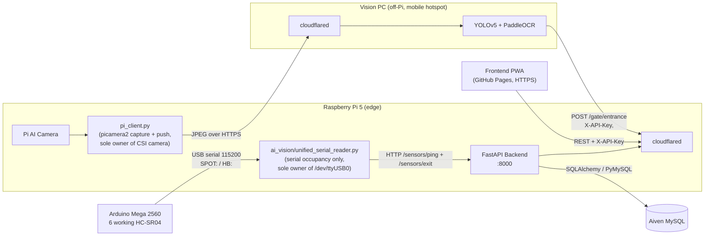

# 🚗 Smart Parking Management System


## 📌 Project Overview
The **Smart Parking Management System** is a next-generation capstone project designed to automate parking lot operations using AI and edge computing. 
By integrating real-time spot monitoring, AI vision-based License Plate Recognition (LPR), and automated entrance/exit control, this system provides a seamless, secure, and highly efficient parking experience.

Designed with an enterprise-grade modular architecture, it acts as the centralized brain hosted on a Raspberry Pi edge server, orchestrating hardware sensors, AI models, and frontend client requests securely over a Tailscale VPN.

---

## 🏗️ System Architecture
The system employs a distributed edge-computing architecture split across three machines:

1. **Edge Device (Raspberry Pi 5):** Hosts the FastAPI backend plus two cooperating processes that split the hardware I/O cleanly. The **serial reader** (`ai_vision/unified_serial_reader.py`) is the single owner of `/dev/ttyUSB0`: an **Arduino Mega 2560** drives the HC-SR04 ultrasonic sensors and streams occupancy events over **USB serial @ 115200**, and the reader dispatches each line by prefix — `SPOT:` events become `/sensors/ping` + `/sensors/exit` HTTP calls to the backend. The **camera capture loop** (`ai_vision/pi_client.py`) is the single owner of the CSI camera: it continuously **captures** JPEG frames (lightweight `picamera2`, **no OpenCV/`cv2`**) and **pushes them over HTTP** to the off-Pi Vision PC. Separating the two means neither process contends for the other's device — the reader runs occupancy-only via `READER_ENABLE_CAMERA=0` and never opens the camera. (The reader can still own the camera as an all-in-one fallback when `READER_ENABLE_CAMERA=1`; see *Production Deployment*.) The Pi never runs inference.
2. **Vision PC (off-Pi, teammate's machine):** Receives the pushed JPEGs from the Pi via its own **Cloudflare Tunnel** (`<vision-tunnel-host>`), runs YOLOv5 (custom `best.pt`) + PaddleOCR (Korean) for License Plate Recognition, and POSTs the recognized plate to `POST /gate/entrance` on the FastAPI backend (inbound via the Pi's `<backend-tunnel-host>` Cloudflare Tunnel). The off-Pi vision pipeline is owned by the vision-PC teammate.
3. **Backend API (FastAPI):** Orchestrates business logic, validates payloads with Pydantic v2, persists state via SQLAlchemy, and exposes the REST API.
4. **Database (Aiven MySQL):** Cloud-hosted relational store for spots, sessions, sensors, transactions, and pricing policies.
5. **Frontend (PWA):** Single-file PWA (`index.html`) deployed to **GitHub Pages** (its own repo / `docs` branch — *not* served from the Pi). It is opened in a browser over **HTTPS**. Backend wiring is centralized in an in-file `API_CONFIG` block (`BASE_URL`, `API_KEY`, `USE_MOCK`); because GitHub Pages is HTTPS, `BASE_URL` must point to the backend's **Cloudflare Tunnel** HTTPS URL (see the note below).



*Note: **Cloudflare Tunnels** replace the previous manual Tailscale/Funnel setup — they punch outbound from the Pi and the Vision PC, so neither needs an inbound port and both work from behind the **school firewall**. `<backend-tunnel-host>` exposes the Pi's backend (used by the frontend and by the Vision PC's plate POST); `<vision-tunnel-host>` exposes the Vision PC (used by the Pi to push captured JPEGs). The GitHub Pages frontend is public HTTPS, so it must reach the backend via the HTTPS `<backend-tunnel-host>` tunnel — a browser on an HTTPS page cannot call the Pi's plain-HTTP API directly (mixed-content). All protected endpoints require an `X-API-Key` header validated against `HEXAVISION_API_KEY`.*

---

## 🔧 Hardware Components

| Component | Model / Spec | Quantity | Role |
|---|---|---|---|
| Raspberry Pi | Pi 5 (16 GB RAM) | 1 | Central hub & Edge Server (FastAPI + serial reader) |
| Microcontroller | Arduino Mega 2560 | 1 | Reads HC-SR04 sensors; streams occupancy over USB serial @115200 |
| AI Camera Module | Raspberry Pi AI Camera (Sony IMX500) | 1 | LPR feed for off-Pi YOLOv5 / PaddleOCR |
| Ultrasonic Sensor | HC-SR04 | 6 working | Parking spot occupancy detection (S2,S3,S4,S5,S6,S8; S1/S7 dead) |
| Touch Display | 7-inch Capacitive LCD Monitor (HDMI) | 1 | Local status UI |
| LED Indicators ¹ | Red / Green LEDs | 8 | Spot status display (Occupied / Free) |
| Testbed Base | Woodrock 3T Foam Board + Mounting Pins | 1 set | Physical parking-lot mockup layout |
| Scale Model Vehicles | Diecast miniature cars (Avante N, Grandeur GN7, Morning, Ioniq 6) | 4 | Evaluation & demo testbed assets |
| Misc. Electronics | Jumper wires, breadboard, power supply | 1 set | Interconnections and power routing |

> ¹ **LED Indicators — Design-phase component:** LED logic is fully implemented in software and reflected in the system design blueprint, but the LEDs are **not physically wired** in the current hardware build. They are retained as a planned component pending a future wiring iteration.

### 🗺️ Wiring Overview

```text
[Ultrasonic Sensors] ---> Arduino Mega (Echo / Trig pins) ---> USB serial 115200 ---> Pi (ai_vision/unified_serial_reader.py)
[LED Indicators] -------> Arduino Digital Out        (planned; not currently wired)
[AI Camera Module] -----> Pi CSI Port
[Touch Display] --------> Pi HDMI Port
```

> **⚠️ NOTE:** The Pi backend does not touch GPIO directly — the Arduino owns all sensor I/O and the Pi consumes events via `ai_vision/unified_serial_reader.py` over USB. Flash the Arduino and start the reader (`python ai_vision/unified_serial_reader.py`) so occupancy events reach the API.

---

## 🛠️ Tech Stack

### Backend
* **Framework:** FastAPI (Python 3.13)
* **Validation:** Pydantic v2
* **Server:** Uvicorn
* **Serial reader:** `ai_vision/unified_serial_reader.py` (pyserial + requests) — sole owner of `/dev/ttyUSB0`: Arduino USB serial → HTTP occupancy pings (`READER_ENABLE_CAMERA=0` in the deployed hybrid; can also drive the camera as an all-in-one fallback)
* **Camera capture:** `ai_vision/pi_client.py` (picamera2 + requests) — sole owner of the CSI camera: captures JPEG frames and pushes them to the off-Pi Vision PC

### Database
* **Database Engine:** Aiven MySQL
* **ORM:** SQLAlchemy (PyMySQL driver)

### AI & Computer Vision (runs **off-Pi**)
* **Object Detection:** YOLOv5 (custom `best.pt` weights, vehicle & plate detection)
* **OCR:** PaddleOCR (License Plate Recognition)
* **Pi-side camera:** lightweight `picamera2` only — **no OpenCV/`cv2`** on the Pi. `pi_client.py` encodes each frame straight to JPEG in memory via `io.BytesIO` + `picamera2.capture_file(..., format="jpeg")` (no `cv2.imencode`) and sends it over HTTP to the remote Vision PC; all inference happens off-Pi.
* The full vision pipeline runs on a teammate's PC. The Pi only captures/forwards frames; the on-Pi code in `ai_vision/` is limited to capture and forwarding.

### Infrastructure & Security
* **Edge Server:** Raspberry Pi 5
* **Networking:** **Cloudflare Tunnels** (replacing manual Tailscale/Funnel) to traverse the **school firewall** without inbound ports — `<backend-tunnel-host>` exposes the Pi's backend (frontend + Vision PC → backend); `<vision-tunnel-host>` exposes the Vision PC (Pi → Vision PC image push). Each tunnel dials outbound from its own host, so the Vision PC can sit on a mobile hotspot 30 km away.
* **Environment:** `.env` for secrets (ignored via `.gitignore`)

---

## 📡 Core API Endpoints

| Method | Endpoint | Description | Auth Required |
|---|---|---|---|
| GET | `/` | System health check | ❌ |
| GET | `/spots` | Real-time occupancy for all spots (reads `ParkingSpots.is_occupied`) | ❌ |
| POST | `/sensors/ping` | Update a spot's `is_occupied` from a sensor reading (`device_id_hw`, `status`) | ✅ |
| POST | `/sensors/exit` | Sensor-driven exit: close the active session for a vacated spot and charge | ✅ |
| POST | `/gate/entrance` | Register vehicle entry; assigns first available spot in lot | ✅ |
| POST | `/gate/exit` | Close session by plate; compute fee via PricingPolicy (fallback: 1,000 KRW/10 min) | ✅ |
| POST | `/lpr/trigger` | Capacity guard — returns 400 immediately if lot is full; else signals YOLOv5 | ✅ |
| GET | `/transactions/{plate}` | Full payment ledger for a plate, newest-first | ✅ |
| GET | `/dashboard/metrics` | Lot-wide snapshot: total/occupied/available spots + cumulative revenue (KRW) | ✅ |

> **Note:** Interactive Swagger/ReDoc docs are **disabled in production** (`APP_ENV=production` ⇒ `docs_url`/`redoc_url`/`openapi_url` are `None`) so the public tunnel does not expose the full API surface to anonymous callers. They are available only when running locally with `APP_ENV=development` at `http://<pi-ip>:8000/docs` on the LAN.
> All protected endpoints require an `X-API-Key` request header. The key is loaded from `HEXAVISION_API_KEY` at server startup and validated by the `require_api_key` FastAPI dependency.

<!-- Auth Policy Notes:
- /spots (GET): Public read access intentional for display boards
- /transactions/{plate} (GET): Exposes financial records — API key required -->

---

## 🛡️ Key Features & Security

* **Master API Key Guard:** All write and read-sensitive endpoints enforce a `require_api_key` FastAPI dependency that validates the `X-API-Key` header against `HEXAVISION_API_KEY` at the application layer. Missing or incorrect keys receive a 403 response.
* **Robust Input Validation:** All incoming payloads are strictly validated using Pydantic models to prevent malformed data injections. Korean license plate strings are sanitized via `re.sub(r"[^0-9가-힣]", ...)` before persistence.
* **CORS Configuration:** Cross-Origin Resource Sharing (CORS) is explicitly configured to allow requests only from authorized frontend domains (driven by `ALLOWED_ORIGINS`). Wildcard `*` is rejected at startup when `APP_ENV=production`.
* **Environment-Based Credential Management:** All sensitive keys and database URIs are loaded dynamically via environment variables, strictly excluded from GitHub via `.gitignore`.
* **Capacity Guard on LPR Trigger:** `POST /lpr/trigger` performs a lot-availability subquery before signalling the YOLOv5 pipeline, preventing unnecessary inference when the lot is full.
* **PricingPolicy-Driven Fee Calculation:** `POST /gate/exit` resolves the active `PricingPolicy` for the lot (with free-time allowance and hourly rate), falling back to a hardcoded 1,000 KRW per started 10-minute block, and records a `PaymentTransaction` atomically.
* **Sensor-Based Exit (no exit camera):** When a spot's ultrasonic reading flips occupied → vacant (`1 → 0`), `ai_vision/unified_serial_reader.py` posts `/sensors/ping` (status 0) **and** `/sensors/exit`, which closes the spot's active session and charges it using the same fee logic as `/gate/exit`.
* **Hardware Decoupling:** Hardware-specific logic (sensors, cameras) is abstracted away from core API services, ensuring the backend remains testable and scalable.

---

## 🔐 Prerequisites & Access
> **⚠️ CRITICAL:** The backend runs on a local Edge Server (Raspberry Pi 5). It is reachable publicly over the **Cloudflare Tunnel** at `https://<backend-tunnel-host>` (which traverses the school firewall with no inbound ports), or directly at `http://<pi-ip>:8000` on the same LAN.

- **[uv](https://github.com/astral-sh/uv)** package manager installed
- **`cloudflared`** installed and the tunnel token configured (Pi backend = `<backend-tunnel-host>`; Vision PC = `<vision-tunnel-host>`)
- Appropriate `.env` file credentials (request from the Lead Architect)

### Database seed prerequisites
Before the end-to-end flow will work against a fresh Aiven schema, the following rows must already exist:
- **`ParkingSpots`** — the spots themselves (the live lot has 10, `spot_number` 1–10). `GET /spots` and `/sensors/ping` resolve spots by `spot_number`; `/sensors/ping` no-ops if no matching spot row exists.
- **`SpotDevices`** — one row per HC-SR04 sensor, with `device_id_hw` like `HC-SR04-01` and `device_role='sensor'`. (Note: occupancy is now stored on `ParkingSpots.is_occupied`; `SpotDevices` rows remain for inventory/traceability — see `CODE_AUDIT.md` M3.)
- **`PricingPolicies`** — at least one active row for the lot (`applied_until IS NULL`). Without it, `POST /gate/exit` silently falls back to the hardcoded 1,000 KRW per 10-minute block.

---

## 🚀 Installation & Quick Start Guide

> This project uses **[uv](https://github.com/astral-sh/uv)** as its package manager. Only the backend runs on the Pi, so a **single `.venv`** is needed here. The vision pipeline runs on a separate machine (its own environment); see [`ai_vision/`](ai_vision/) and `requirements-vision.txt`.

### 1. Clone the Repository
```bash
git clone https://github.com/lee-giyu/hexa-vision-parking.git
cd hexa-vision-parking
```

### 2. Set Up the Backend `.venv` (Python 3.13)
Create and activate the backend virtual environment:
```bash
uv venv                          # creates .venv with Python 3.13
source .venv/bin/activate        # Windows: .venv\Scripts\activate
uv pip install -r requirements.txt
```
> **Note:** `requirements.txt` currently also carries heavy vision/CUDA wheels (torch, ultralytics, …) that the backend does not need — see `CODE_AUDIT.md` (M5). A backend-only install needs just FastAPI, Uvicorn, SQLAlchemy, PyMySQL, Pydantic, python-dotenv, pyserial, and requests.

### 3. Configure Environment Variables
Create a `.env` file in the root directory:
```ini
# .env
DB_USER=
DB_PASSWORD=
DB_HOST=
DB_PORT=
DB_NAME=
HEXAVISION_API_KEY=<your-secret-api-key>   # required; guards all protected endpoints
ALLOWED_ORIGINS=http://localhost:3000,http://localhost:5173
# APP_ENV=production  # uncomment to enforce strict CORS (rejects wildcard origins)
```
*(Never commit `.env` to version control — it is already excluded via `.gitignore`.)*

### 4. Run the Server
Activate the backend environment and launch (either form works):
```bash
source .venv/bin/activate
uvicorn app.main:app --host 0.0.0.0 --port 8000 --reload
# or the root launcher:
python main.py
```

### 5. Run the Serial Reader (hardware occupancy)
With the Arduino Mega flashed (`arduino/parking_sensors/`) and connected via USB, start the
serial reader. It is the **sole owner** of `/dev/ttyUSB0` and dispatches each line by prefix:
`SPOT:`/`HB:` → backend occupancy pings (`/sensors/ping` + `/sensors/exit`). In the hybrid
deployment the camera is handled by a separate process (see §5b), so the reader runs
occupancy-only with `READER_ENABLE_CAMERA=0`. It runs in `.venv_capture` (not `.venv`) so it can
import the apt-installed `picamera2`:
```bash
source .venv_capture/bin/activate
READER_ENABLE_CAMERA=0 python ai_vision/unified_serial_reader.py   # reads /dev/ttyUSB0 @115200; POSTs /sensors/ping + /sensors/exit
```
> **All-in-one fallback:** omit `READER_ENABLE_CAMERA=0` (or set `=1`) to let the reader also own
> the camera and capture a frame burst on each `ENTRY:1` trigger — useful when running without the
> separate capture service.

### 5b. Run the Camera Capture Loop (entrance → Vision PC)
The CSI camera is owned by `ai_vision/pi_client.py`, which captures JPEG frames and pushes them to
the off-Pi Vision PC. It also runs in `.venv_capture`:
```bash
source .venv_capture/bin/activate
python ai_vision/pi_client.py     # captures frames and POSTs them to the Vision PC (SERVER_URL)
```

### 6. Frontend (GitHub Pages)
The PWA is **not** served from the Pi. It is published to **GitHub Pages** (its own repo / `docs`
branch) and opened in a browser over HTTPS. Set `API_CONFIG.BASE_URL` in `index.html` to the
backend's **Cloudflare Tunnel** HTTPS URL (not `http://localhost:8000` and not a raw Tailscale
IP) — an HTTPS page cannot call a plain-HTTP API due to browser mixed-content rules.

### 7. Test the API
Once the server is running (and connected to Tailscale), navigate to the interactive API docs:
* **Swagger UI:** `http://<RASPBERRY_PI_TAILSCALE_IP>:8000/docs`
* **ReDoc:** `http://<RASPBERRY_PI_TAILSCALE_IP>:8000/redoc`
* **Tests:** `pytest -q` (runs the in-memory SQLite lifecycle suite; no DB/Tailscale needed)

---

## 🏭 Production Deployment (systemd)

For unattended operation, the Pi runs **systemd services** so the whole system comes up on
power-on (assuming Wi-Fi auto-connects), restarts on failure, and logs to `journald`. The
three app unit files live in [`deploy/systemd/`](deploy/systemd/); the installer links them
from the repo (single source of truth) and enables them. The fourth service, `cloudflared`,
is installed by the Cloudflare connector and must also be **enabled for boot**.

| Service                      | venv            | What it does                                              |
|------------------------------|-----------------|-----------------------------------------------------------|
| `hexavision-backend.service` | `.venv`         | `uvicorn app.main:app` on `0.0.0.0:8000` (no `--reload`)  |
| `hexavision-reader.service`  | `.venv_capture` | `ai_vision/unified_serial_reader.py` — sole owner of `/dev/ttyUSB0`, serial occupancy only (`READER_ENABLE_CAMERA=0`): `SPOT:`/`HB:` → API. `ENTRY:` lines are logged, not captured (the camera belongs to the capture unit). |
| `hexavision-capture.service` | `.venv_capture` | `ai_vision/pi_client.py` — sole owner of the CSI camera: captures JPEG frames and HTTP-pushes them to the Vision PC at `<vision-tunnel-host>` |
| `cloudflared.service`        | —               | Cloudflare Tunnel for `<backend-tunnel-host>` → `localhost:8000` (backend inbound through the school firewall) |

Both hardware units use a **separate** `.venv_capture` (built with `--system-site-packages` so
they can import the apt-installed `python3-picamera2` / `python3-libcamera`, which cannot be
pip-installed, alongside `requests`/`pyserial`). Create it once with:
```bash
uv venv .venv_capture --python 3.13 --system-site-packages
```

> **Why the split.** The *serial* bus has exactly **one** owner by design: a USB serial port
> cannot be shared by two readers (the kernel delivers each byte to only one), so an earlier
> attempt to run two serial processes (`hexavision-bridge` + the old serial-splitting
> `hexavision-capture`) was unsafe and was merged into `ai_vision/unified_serial_reader.py` — see
> [`CODE_AUDIT.md`](CODE_AUDIT.md) → *H2*. The **camera** is a different device, so it is now split back out
> into its own `hexavision-capture.service` (`pi_client.py`): the reader runs with
> `READER_ENABLE_CAMERA=0` and never opens the camera, so the two units never contend.
> `install_services.sh` still removes the obsolete `hexavision-bridge` unit if a previous install
> left it behind.

### Install & enable (one-time, needs root)
```bash
sudo ./deploy/install_services.sh     # links app units, daemon-reload, enables all three for boot
sudo systemctl enable cloudflared     # enable the tunnel for boot (<backend-tunnel-host>)
```
This **enables** the app units for boot but does **not** start them; `install_services.sh`
also removes the obsolete `hexavision-bridge` unit if a previous install left it behind. Enabling
`cloudflared` closes the last boot gap so `<backend-tunnel-host>` comes back automatically after a
power-cycle.

### Start / stop / status
```bash
# Start the backend, then the serial reader and the camera capture loop:
sudo systemctl start hexavision-backend
sudo systemctl start hexavision-reader
sudo systemctl start hexavision-capture

# Status & health
systemctl status hexavision-backend hexavision-reader hexavision-capture

# Stop / restart
sudo systemctl stop  hexavision-capture
sudo systemctl restart hexavision-backend

# Live logs (journald)
journalctl -u hexavision-backend -f
journalctl -u hexavision-reader -f
journalctl -u hexavision-capture -f

# Disable a unit from boot
sudo systemctl disable hexavision-capture
```

**Capture path (hybrid deployment).** `pi_client.py` (the `hexavision-capture` unit) continuously
pushes JPEG frames over HTTP to the Vision PC at its `SERVER_URL`. The vision teammate's PC runs
YOLO + OCR off-Pi and itself POSTs the recognized plate to the backend's `POST /gate/entrance`
(inbound via `<backend-tunnel-host>`) so the DB + frontend update. The Pi performs **no** inference itself.

**All-in-one fallback (`READER_ENABLE_CAMERA=1`).** When the reader owns the camera instead, an
`ENTRY:1` trigger fires a **burst** capture — for `CAPTURE_BURST_SEC` (default 10s) it captures as
fast as the hardware allows rather than a single still, since one shot often fires too early (hands
/ car roof) or is motion-blurred. Each frame is written to `captures/` (override `CAPTURE_DIR`;
filenames carry microseconds so a burst never overwrites itself) **and** pushed to the Vision PC at
`VISION_URL` (default `https://<vision-tunnel-host>/detect`). The Vision PC **returns the recognized
plate in its JSON response**; the reader parses it defensively (it tries `plate_number` / `plate` /
`license_plate` and a `results[]` list) and forwards the **first** hit exactly once to
`POST /gate/entrance` so one burst opens at most one session. A re-trigger debounce
(`CAPTURE_COOLDOWN`, default 10s, measured from the **end** of the burst) prevents overlapping
bursts. Every hop fails soft: a tunnel/hotspot outage, a non-JSON response, a plate-less result, or
a single bad frame is logged but never stops occupancy reads.

---

## 📄 License
This project is licensed under the **MIT License**.
